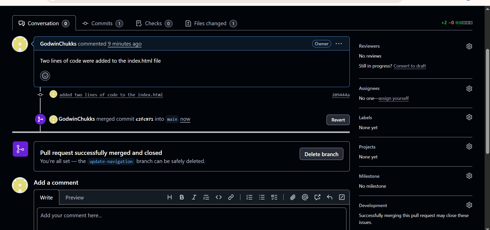
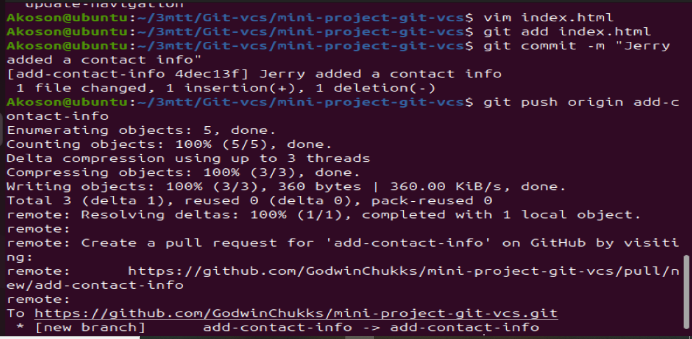

# Git version control system.

## Git is a free and open-source version control system that helps developers track changes in their code, collaborate with others, and manage different versions of a project efficiently.

# Why Git is need

1. Tracks every change made to a file (who made it and when)

2. Prevents accidental code loss

3. Enables smooth collaboration on projects

4. Supports remote backups using platforms like GitHub, GitLab, or Bitbucket

5. Helps in debugging by comparing previous working versions

6. Git helps you stay organized, collaborate confidently, and never lose your work — it's an essential tool for any developer


## Conceptualizing Git Set Up with Tom and Jerry.

1. Initial Setup

- Both Tom and Jerry have Git installed on their systems.

- They clone or download the project repository from a central repository like Github to their local computers. This give them each a complete copy of the project, including all its files and version history.

2. Tom and Jerry start working:

- Tom and Jerry pull the latest changes from the central repository to ensure they start with the most current version of the index,html file.

- They both create a new branch from the main project. A branch in Git allows developers to work on a copy of the codebase without affecting the main line of developement. Tom names his branch update-navigation, and Jerry names his add-contact-info

3. Making Changes:

- On his branch, Tom updates the navigation bar in index.html

- Simulteneously, Jerry works on his branch to add contact information to the footer of the same file.

- They commit their changes to their respective branches. A commit in Git is like saving your work with a note about what you have done.

4. Merging Changes:

- Once they are dine, Tom and Jerry push their branches to the central repository.

- Tom decides to merge his changes first. He creates a pull request (PR) for his branch "update-navigation". A PR is a way to tell the team that he is done and his code is ready to be reviewed and merged into the main branch project.

- After reviewing Tom's changes, the team merges his PR into the main branch, updating the index.html file on the main project line.

- Jerry then updates updates his branch with the latest changes from the main project to include Tom's updates. This step is crucial to ensure that Jerry is working with and integrating his changes into the most current version of the project.

- Jerry resolves any conflicts that arise from the Toms changes and his own. Git provides tools and command to help identify and resolve these conflict. 

- Jerry then pushes his updated branch and creates a PR for his changes. The team reviews Jerry's additions, and once they're approved, his changes are merged into the main project.

## Understanding merge conflict in Git:

### Git conflicts happens Two people try to change the same part of the same file in different ways.Git doesn't know which version is correct — yours or the other person's — so it stops and asks you to decide.

## Imagine this:

### Tom and Jerry are editing the same story.

### Tom change this line:
### The cat was black to The cat was white.

### and Jerry changes the same line:
### The cat was black to The cat was orange.

### Now Git is confused:Should the cat be white or orange?

### So Git creates a conflict, and it shows you both versions like this:

<pre>```<<<<<<< HEAD
The cat was white.
=======
The cat was orange.
>>>>>>> friend's version
```</pre>

### You have to edit the file manually to pick the correct line (or combine them), then tell Git the conflict is resolved.

# Setting up main project


## Creating an index.html file for the main project


## index.html file 


## Git Dashboard before push is made


## Adding or staging, committing or saving the index.html file, and pushing to remote remote git repository 


# Tom and Jerry start work:

## Tom use git checkout command to verify he is on the main project branch, he then use git pull origin main to ensure he is working with the latest update on the main branch. Tom now use git checkout -b update-navigationto create new branch call update-navigationand also switch to the new branch he created.

## He used the command git branch to verify he is on the update-navigationbranch he created.

## You notice that git branch command outputs two branches main branch and update-navigation branch. The esteric by the update-navigation signifies that Tom is currently  on the update-navigation.


## Tom update the index.html file by adding lines of code. But in this demo we only added two lines of code to the main branch.


## Tom staged the latest code he then commit it with a message and push it to the update-navigationbranch.


## Github dashboard after to has push his latest code to the update-navigation branch


## Tom want to merge his updated code to the main branch. He create a PR for his branch update-navigation

## From the Git dashboard you’ll see a prompt: "Compare & pull request" for your pushed branch Click it.

## On the Pull Request page:

### Title: Update index.html with new content

### Description: Briefly describe what you added (e.g., added a new paragraph and a button to the page).

### Ensure the base branch is main, and compare is your branch (update-index-page).

### Click "Create pull request".


## After viewing Tom's changes the team merges his PR into the main branch, and updating the index.html files on the main project line.

- Click “Merge pull request”.

- Then click “Confirm merge”.

- Optionally, click “Delete branch” to clean up.




## Option 2: Merge from the Command Line (for solo work or offline)

### Switch to the main branch:

checkout main

### Pull the latest changes from the remote main:

git pull origin
main

### Merge your feature branch (e.g., update-index-page) into main:

git merge update-navigation

### Push the updated main branch back to GitHub:

git push origin main


# Jerry's Branch

## Jerry then updates his branch from the main project to include Tom's update. These version is important to ensure Jerry is working the update version of the code.

## For creating Jerry's branch add-contact-info 

- Ensure you're on the latest version of the main branch. 

- Then create and switch to the new branch for Jerry. 

- Now Jerry can make his changes on index.html or any other files
Stage and commit Jerry’s changes after editing the index.html file.

- Push Jerry’s changes to add-contact-info branch


## Jerry edit the index.html file and make changes the same line of code Tom updated. This will create a merge contact.


## Jerry saves the file and editing. He now stage the file, commit and push to add-contact-info branch



## Jerry's push is detected on Github. Jerry will now click on the prompt compare and pull


## Jerry PR: 


## Jerry's Merge


# Now we are going to simulate conflict between Tom changes and Jerry's changes.

# Tom changes

##  Start from the main branch Make sure your main is up to date


- Create and update a branch for Tom

- Edit the file index.html and modify the same <p> line. Save and commit


- Save and commit


# Jerry's update

## switch back to main. Pull the main code, then create and switch to Jerry's update branch.


## Edit the same line in index.html:


## staging, committing and pushing to jerry-update branch


# Merging both branches to main main branch which will trigger a conflict because we Tom and Jerry edited same line of code in main branch

## Merging Tom branch:

- Switch to the main branch before merging Tom branch to main branch. This will suceed. No conflict yet.


# Merging Jerry's branch to main branch.

## Ensure you are on main branch before merging Jerry's branch to main branch. This will trigger merge conflict.


## Git will modify index.html to look like this:


## Now you can resolve the conflict manually by editing that line to reflect the desired content, for example


## Then complete the merge:


## To confirm merging Jerry update to main branch


## Final Git Dashboard


